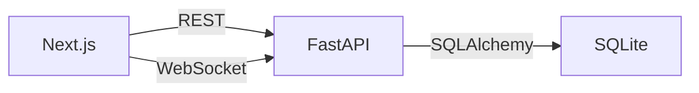

# Signal-Inspired Messenger

A full-stack, real-time messaging application inspired by Signal, built as an SDE Fullstack Assignment for Scalar AI Labs.

[](https://github.com/abhiram_bency/signal-inspired-messenger/actions/workflows/backend-ci.yml)

## Demo

**Frontend**:  
[https://signal-inspired-messenger.vercel.app](https://signal-inspired-messenger.vercel.app)

**Backend / API**:  
[https://signal-inspired-messenger.onrender.com](https://signal-inspired-messenger.onrender.com)

**GitHub Repository**:  
[https://github.com/abhiram-bency/signal-inspired-messenger](https://github.com/abhiram-bency/signal-inspired-messenger)

> *This application demonstrates a modern chat architecture using Next.js, FastAPI, WebSockets, and SQLite.*

---

## Features

### Authentication & Onboarding
- **Registration**: Register with a username or phone number.
- **Mock OTP**: Use a mocked OTP (`123456`) to bypass real SMS for easy evaluation.
- **Login/Logout**: Secure session persistence utilizing HTTP-only cookies.
- **Profile**: Edit display name, username, and avatar URL.

### Contacts
- **Search Users**: Find other registered users globally by username or display name.
- **Manage Contacts**: Add or remove users from your contact list.

### Direct Messaging
- **One-on-One Conversations**: Start private chats with contacts.
- **Real-Time Delivery**: Messages are pushed instantly via WebSockets.
- **Persistent History**: All messages are safely persisted in SQLite.
- **Message States**: Visual timestamps and optimistic sending UI.

### Groups
- **Create Groups**: Form groups by selecting multiple contacts.
- **Group Messaging**: Send real-time messages to all group members.
- **Member Management**: Add or remove members with admin/member roles.

### Messaging UX
- **Conversation Sorting**: Dynamic sorting based on the latest activity.
- **Conversation Search**: Find active conversations quickly.
- **Last-Message Preview**: See the most recent message directly in the sidebar.
- **Unread & Receipt Infrastructure**: 🟡 *The backend and WebSocket infrastructure is implemented, but the UI updates are currently under investigation.*
- **Typing Indicators**: 🟡 *Transient typing states are routed, but the UI display is currently under investigation.*

### Signal-Inspired UI
- **Dark Theme**: A polished, modern dark interface using semantic design tokens.
- **Layouts**: Responsive sidebar and main chat pane.
- **Message Bubbles**: Styled chat bubbles with clustering logic.
- **Modals & Settings**: Unified modal system for Profile, Contacts, Group Members, and Settings.
- **Toasts**: A custom global toast notification framework.

### Placeholders
*The following assignment-permitted placeholders are included for UI completeness:*
- Voice/Video calling buttons (UI only).
- Privacy, Notifications, and Appearance settings tabs (UI only).
- Stories and linked devices.
- End-to-End Encryption (E2EE is mocked/conceptual).

---

## Tech Stack

### Frontend
- **Framework**: Next.js 15 (App Router), React 19
- **Language**: TypeScript
- **Styling**: Tailwind CSS
- **State Management**: Zustand
- **Validation**: Zod + React Hook Form
- **Icons**: Lucide React

### Backend
- **Framework**: FastAPI (REST + WebSockets)
- **Language**: Python 3.11+
- **ORM**: SQLAlchemy 2.0 (Async)
- **Database**: SQLite (via `aiosqlite`)
- **Security**: PyJWT, passlib/bcrypt

---

## Architecture



The application relies on a decoupled tier structure. Read more in our [Architecture Document](docs/ARCHITECTURE.md).

---

## Local Setup

### Prerequisites
- **Python**: 3.11+
- **Node.js**: 20+

### Backend

```bash
# 1. Navigate to the backend directory
cd backend

# 2. Create and activate a virtual environment
python3 -m venv venv
source venv/bin/activate

# 3. Install dependencies
pip install -r requirements.txt

# 4. Configure environment
cp ../.env.example .env
# Edit .env as needed

# 5. Initialize the database and seed demo data
python manage.py seed

# 6. Run the server
uvicorn app.main:app --reload --host 0.0.0.0 --port 8000
```
Backend available at: `http://localhost:8000`  
API documentation: `http://localhost:8000/docs`

### Frontend

```bash
# 1. Navigate to the frontend directory
cd frontend

# 2. Install dependencies
npm install

# 3. Configure environment
cp ../.env.example .env.local
# Edit .env.local as needed

# 4. Run the development server
npm run dev
```
Frontend available at: `http://localhost:3000`

---

## Authentication & Seed Data

This application uses **mock phone verification**. No real SMS is sent.
- **Mock OTP**: `123456`

If you ran the seed script (`python manage.py seed`), you can log in with:
- **Username**: `alice`, `bob`, or `charlie`
- **OTP**: `123456`

---

## Testing

### Backend
```bash
cd backend
source venv/bin/activate
pytest -v
```

### Frontend
```bash
cd frontend
npm run type-check
npm run lint
npm run build
```

---

## Documentation

Comprehensive documentation mapped to the actual implementation:

- [Assignment Mapping](docs/ASSIGNMENT_MAPPING.md)
- [System Architecture](docs/ARCHITECTURE.md)
- [Database Schema](docs/DATABASE.md)
- [REST API](docs/API.md)
- [WebSocket Protocol](docs/WEBSOCKET.md)

---

## AI-Assisted Development

AI development tools (like GitHub Copilot and other advanced LLMs) were utilized during the implementation of this project to accelerate boilerplate generation, assist with Tailwind styling, and prototype complex WebSocket state management. The final implementation was heavily reviewed, tested, integrated, and manually validated against the assignment requirements to ensure robust architectural standards.

---
*Private assignment — not for redistribution.*
