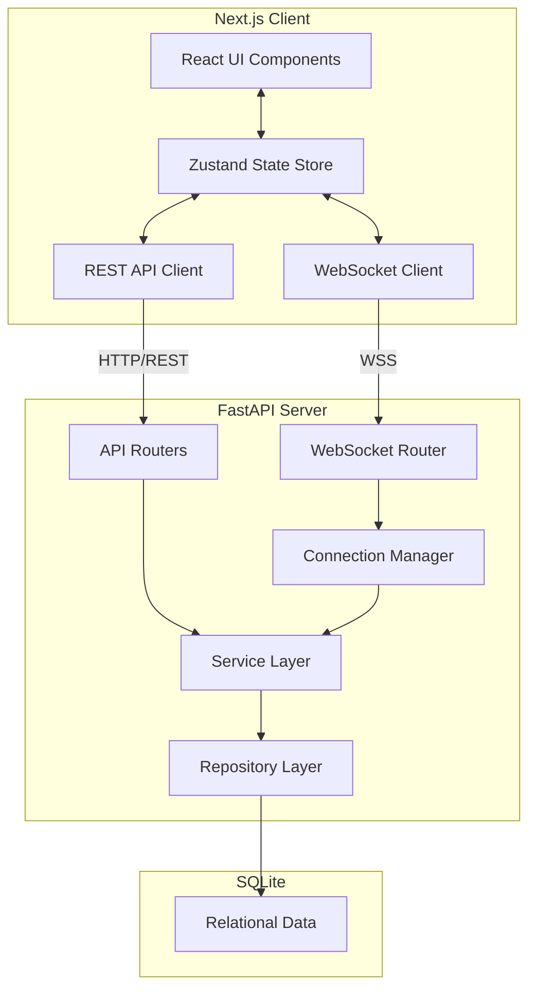

# System Architecture

The application implements a decoupled client-server architecture with a clear separation of concerns, providing both RESTful interactions and real-time capabilities via WebSockets.

## High-Level Architecture

## Frontend Architecture (Next.js)

The frontend is built with **Next.js 15 (App Router)** and utilizes **Zustand** for global state management. 

### Key Components

1. **UI Components (`src/components/`)**:
   - Built with React and styled via Tailwind CSS. 
   - Strict separation between structural layouts (e.g., `Sidebar.tsx`, `ChatWindow.tsx`) and modal overlays (e.g., `ProfileModal.tsx`).

2. **State Management (`src/stores/`)**:
   - **`authStore`**: Manages the current authenticated user and login state.
   - **`chatStore`**: Manages the active conversation, unread message counts, and the list of conversations.
   - **`uiStore` & `toastStore`**: Manages modal visibility, mobile sidebar toggling, and global toast notifications.
   - **`typingStore`**: Specifically handles the transient typing state coming in over WebSocket.

3. **Networking Clients (`src/lib/`)**:
   - **`api.ts`**: A wrapper around `fetch` that automatically includes credentials (cookies) to seamlessly interface with the backend REST API.
   - **`websocket.ts`**: Manages the WebSocket connection lifecycle, including reconnection logic and event dispatching to the Zustand stores.

## Backend Architecture (FastAPI)

The backend implements a classic tiered architecture using **FastAPI** for routing and **SQLAlchemy 2.0 (Async)** for data access.

### Key Components

1. **API Routers (`app/api/`)**:
   - Expose the HTTP endpoints.
   - Responsible strictly for HTTP-level concerns: parsing request parameters, validating input via Pydantic schemas, and returning HTTP responses.
   - Routes delegate business logic to the Service layer.

2. **Service Layer (`app/services/`)**:
   - Encapsulates core business logic (e.g., creating a message, validating group membership).
   - Prevents the API routing layer from being tightly coupled to the database structure.

3. **Repository Layer (`app/repositories/`)**:
   - Encapsulates all SQLAlchemy queries and database interactions.
   - This abstract layer allows the service layer to operate on domain objects rather than directly writing SQL or ORM queries.

4. **WebSocket Manager (`app/websocket/`)**:
   - Maintains a dictionary of active connections mapped to `user_id`.
   - Responsible for broadcasting real-time events (like `message.new` or `receipt.update`) to the correct connected clients.

5. **Database (`app/database/`)**:
   - Uses **SQLite** (via `aiosqlite`) to store persistent data locally, meeting the assignment requirements for a self-contained persistence layer without external dependencies like Postgres.

## Why This Architecture?

1. **Separation of Concerns**: The tiered backend (Router -> Service -> Repository) makes the application highly testable and maintainable. Switching the database engine (e.g., from SQLite to Postgres) would only require changes in the database configuration and minor tweaks in the repositories.
2. **Real-time & Consistency**: Splitting REST for initial loads and mutations, and WebSockets for real-time broadcasts ensures a robust baseline experience. If the WebSocket disconnects, the user can still perform actions via REST.
3. **Optimistic UI**: Zustand allows the frontend to optimistically update the UI immediately upon sending a message, providing a snappy experience while waiting for the WebSocket acknowledgment (`message.ack`).
