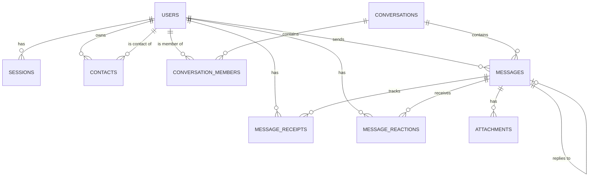

# Database Design

The application utilizes **SQLite** for simplicity, local development ease, and fulfilling the assignment constraints (no external databases like Postgres required). Access is mediated through **SQLAlchemy 2.0 (Async)** via `aiosqlite`.

## Entity-Relationship Diagram

## Schema Details

Below is the actual implemented schema based on the SQLAlchemy models (`backend/app/database/models.py`).

### `users`
Core user identity and profile information.
- `id`: String (UUID) - Primary Key
- `username`: String (Unique, Nullable)
- `phone`: String (Unique, Nullable)
- `display_name`: String
- `avatar_url`: String (Nullable)
- `is_online`: Boolean
- `last_seen_at`: DateTime
- `created_at`, `updated_at`: DateTime

### `sessions`
Authentication sessions for JWT / Cookie verification.
- `id`: String (UUID) - Primary Key
- `user_id`: String (FK to `users.id`)
- `token_hash`: String (Unique)
- `expires_at`: DateTime
- `created_at`, `revoked_at`: DateTime

### `contacts`
Address book links between users.
- `id`: String (UUID) - Primary Key
- `owner_id`: String (FK to `users.id`)
- `contact_id`: String (FK to `users.id`)
- `nickname`: String (Nullable)
- `created_at`: DateTime
*Constraint: Unique(owner_id, contact_id)*

### `conversations`
The container for both direct and group messages.
- `id`: String (UUID) - Primary Key
- `type`: String ('direct' or 'group')
- `name`: String (Nullable, for groups)
- `avatar_url`: String (Nullable, for groups)
- `created_by`: String (FK to `users.id`)
- `created_at`, `updated_at`: DateTime

### `conversation_members`
Links users to conversations and defines their roles.
- `id`: String (UUID) - Primary Key
- `conversation_id`: String (FK to `conversations.id`)
- `user_id`: String (FK to `users.id`)
- `role`: String ('member' or 'admin')
- `joined_at`, `left_at`: DateTime
*Constraint: Unique(conversation_id, user_id)*

### `messages`
The chat messages sent within a conversation.
- `id`: String (UUID) - Primary Key
- `conversation_id`: String (FK to `conversations.id`)
- `sender_id`: String (FK to `users.id`)
- `content`: Text (Nullable)
- `message_type`: String ('text', 'system', etc.)
- `reply_to_id`: String (FK to `messages.id`, Nullable)
- `created_at`, `edited_at`, `deleted_at`: DateTime
*Index: (conversation_id, created_at) for fast pagination.*

### `message_receipts`
Tracks the delivery and read status of messages per user.
- `id`: String (UUID) - Primary Key
- `message_id`: String (FK to `messages.id`)
- `user_id`: String (FK to `users.id`)
- `status`: String ('sent', 'delivered', 'read')
- `delivered_at`, `read_at`: DateTime
*Constraint: Unique(message_id, user_id)*

### `message_reactions` & `attachments`
- **Reactions**: Tracks emojis applied to messages. (`message_id`, `user_id`, `emoji`).
- **Attachments**: Tracks files/media sent within messages. (`message_id`, `file_name`, `file_url`, `mime_type`, `file_size`).
