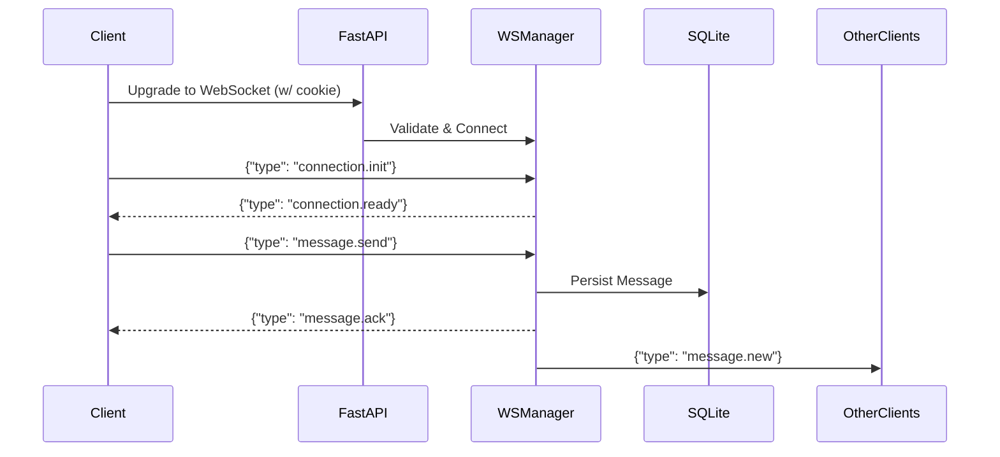

# WebSocket Protocol

The application relies on WebSockets for real-time delivery of messages, receipts, and typing indicators, providing a snappy, Signal-like UX.

## Connection

- **Endpoint**: `ws://<backend-url>/api/v1/ws`
- **Authentication**: Implicitly authenticated via the `session_token` HTTP-only cookie sent with the upgrade request. The backend immediately rejects connections without a valid session.

## Event Architecture

Messages follow an envelope format over JSON:

```json
{
  "type": "event.name",
  "event_id": "uuid",
  "payload": { ... }
}
```

### Event Flow



## Client-to-Server Events

Events the frontend can emit over the socket:

### `connection.init`
Sent immediately upon connection to negotiate state.
- **Payload**: None.

### `message.send`
Sent to emit a new chat message.
- **Payload**: 
  - `client_message_id`: Local UUID for optimistic UI rendering.
  - `conversation_id`: Target conversation UUID.
  - `content`: Text content.
  - `message_type`: 'text'
  - `reply_to_id`: Optional UUID.

### `receipt.update`
Sent when a user reads or receives a message.
- **Payload**:
  - `message_id`: UUID
  - `conversation_id`: UUID
  - `status`: 'delivered' or 'read'

### `typing.start` / `typing.stop`
Sent when the user starts/stops typing in a specific conversation.
- **Payload**:
  - `conversation_id`: UUID

### `ping`
Sent periodically to keep the connection alive.
- **Payload**: None

## Server-to-Client Events

Events the backend broadcasts to connected clients:

### `connection.ready`
Acknowledges `connection.init`.
- **Payload**: `connection_id`, `user_id`, `server_time`.

### `message.ack`
Sent ONLY to the sender of a message to confirm persistence.
- **Payload**: The fully hydrated `message` object (including server-generated `id` and `created_at`), matching the original `client_message_id`.

### `message.new`
Sent to all *other* members of a conversation when a message is created.
- **Payload**: The fully hydrated `message` object.

### `receipt.update`
Broadcast to conversation members when someone updates a receipt status.
- **Payload**: `message_id`, `conversation_id`, `user_id`, `status`.

### `typing.start` / `typing.stop`
Broadcast to conversation members when someone begins typing.
- **Payload**: `conversation_id`, `user_id`, `display_name`.

### `error`
Sent if an invalid payload is received or validation fails.
- **Payload**: `code`, `message`.

### `pong`
Sent in response to a `ping`.
